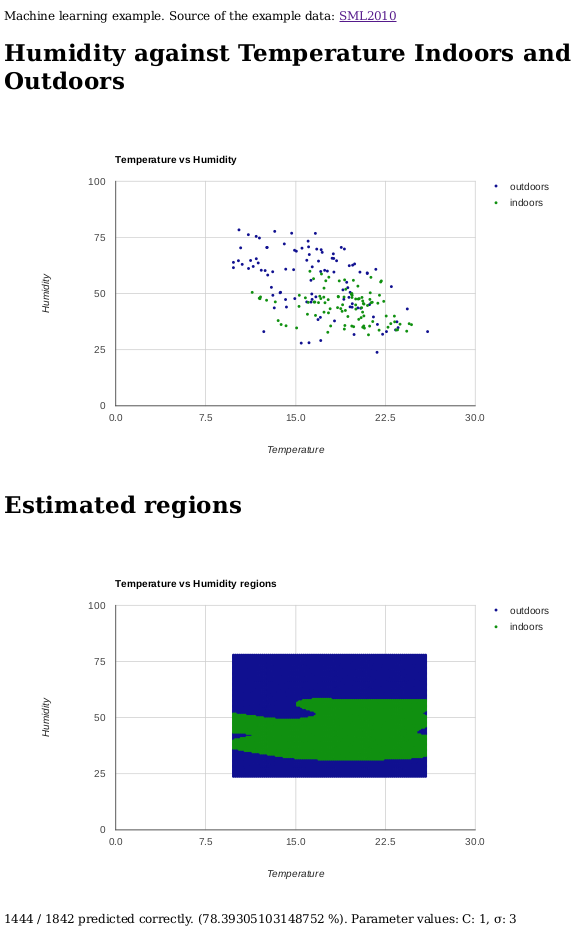

# Summary
This is a basic example for using Support Vector Machines in machine learning.

# Installation
`npm install`

# Execution
`node index.js`

Point your browser to: [http://localhost:8080](http://localhost:8080)

# Support Vector Machines

[A great summary about SVMs](http://pages.cs.wisc.edu/~jerryzhu/cs540/handouts/hearst98-SVMtutorial.pdf)

## Theory

Support Vector Machine is a really simple, very general machine learning algorithm. It can be used to
classify continuous valued data into two categories based on given examples.

Support Vector Machine has been called one
of the few truly black box intelligent algorithms, that is, an algorithm that does not require much tuning
or data modelling. It has great numerical properties, always converges and is pretty much idiot proof.

Support Vector Machine works by embedding the input data vectors into very high dimensional (as many dimensions
as there are training data points) "feature space".
The feature space is defined by using a "kernel trick", that is, each dimension in the feature space is
simply a distance to the respective input data point mapped through a gaussian (or some other) function.

So, considering a data matrix with 3 measurements of 2D input data (the column vectors are input data vectors):

    |    |
--- | --- | ---
 a  |  b  |  c

 .=

    |    |
--- | --- | ---
 1  |  2  |  3
 1  |  1  |  1

Then the 3 training data points in the feature space matrix would be 3D (g is the gaussian bell function):

          |          |
   ---     |    ---     |    ---
g(\|a-a\|) | g(\|b-a\|) | g(\|c-a\|)
g(\|a-b\|) | g(\|b-b\|) | g(\|b-c\|)
g(\|a-c\|) | g(\|b-c\|) | g(\|c-c\|)

 .=

     |      |
 --- |  --- |  ---
g(0) | g(1) |  g(2)
g(1) | g(0) |  g(1)
g(2) | g(2) |  g(0)

In this higher dimensional space it is possible to define a single hyperplane to divide the training data points
into two parts, the ones that belong to the given category and the ones that don't.

The SVM algorithm defines such a hyperplane through linear programming methods so that the hyperplane is a "maximum margin
separation hyperplane". Classification becomes a simple test of whether the embedded data point lies on the positive
or the negative side of that hyperplane.

After defining the SVM with the training set, the SVM can be used to classify new data points. You simply need to
embed the new points to the original feature space (that is, measure the distances to each of the training points and
map through the gaussian), and then check which side of the learned maximum margin separation hyperplane does the new point
fall to.

Luckily there are libraries to do all the above for you, even though this is very simple as far as machine learning
algorithms go.

## Practice

Always when you use machine learning algorithms, you need three sets of data:

 1. Training set, to train your algorithm with.
 2. Test set, to test with different data that your algorithm works and is well parametrized.
 3. Validation set, after you have trained your system and found good parameters with testing, you need to test
    the final system with new data again to make sure you haven't simply taught your test set data to the system
    with your parametrization.

This is to prevent overfitting. Overfitting is a fundamental property of all learning algorithms. It means the
algorithm only learns the data you have "by heart", without learning the higher level patterns that allow the algorithm to
properly classify the new, previously unseen data.

Overfitting is tested by giving the system new, previously unseen data. If the system performs significantly worse
with this new validation data, than with the test data, then the system has overfitted, and everything should be thrown
to trash.

# Screenshot

